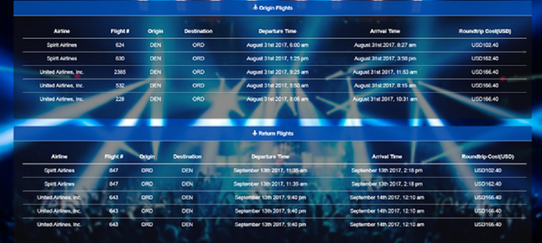

# WanderPop
An airfare and event search app to help you plan your next trip! This application utilizes several API's to be a useful tool in helping a user plan out an entertaining trip. The API's involved in this application are QPI Express, Google Maps, and Eventful.

## Use of App

1.) Once you are on the main page you will enter the criteria for your upcoming flight. You will need to input the departing city and destination city as well as the dates of travel, and the number of passengers. Once you click go it will call the API and display the results.

2.) At the top of the page will be a form to modify the search results followed by a google map of all the venue locations of events happening in the destination city. The maximum number of events returned will be 10 to optimize the user experience. If a user wants to modify their search all they need to do is change a the fields and click go to modify the results.

3.) The middle of the page will display departing/returning flight data. It will only display 5 flights for each leg of the trip for functionality and a clean look of the app.

4.) The bottom of page will have the details for the first 10 results the eventful API returns as well as a back button. The back button will return you to the home page.

